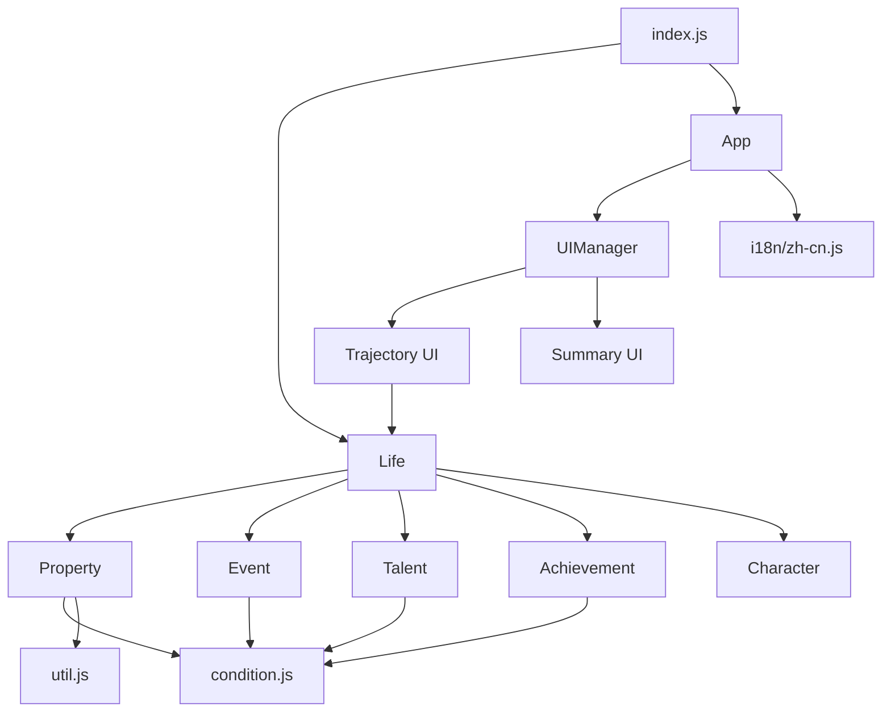
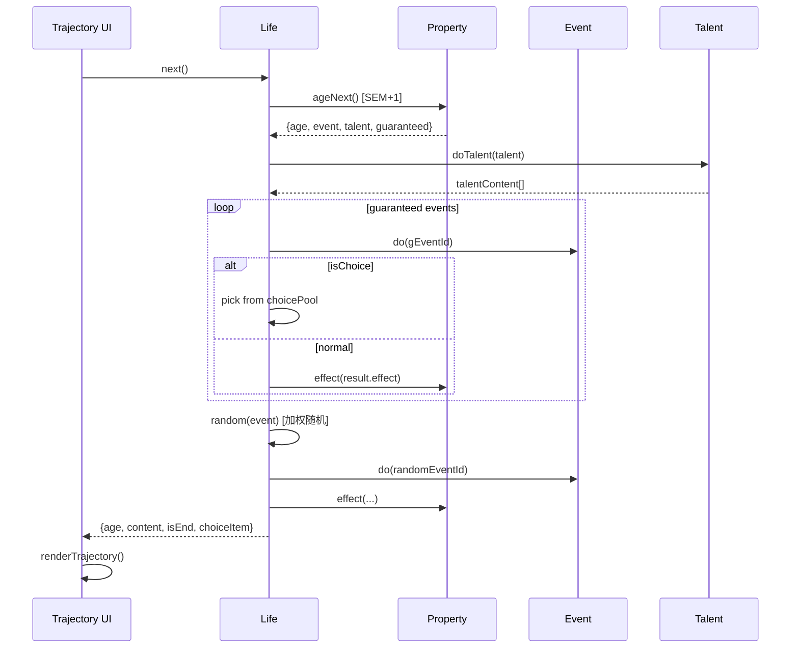

# 架构概览

## 技术栈

- **渲染引擎**: LayaAir (WebGL)
- **构建工具**: Vite
- **数据管线**: xlsx → v-transform → JSON
- **部署**: Docker / 静态文件

## 项目目录结构

```
SchoolRestart/
├── src/
│   ├── index.js              # 入口：初始化 Life 实例、全局配置
│   ├── app.js                # Laya 引擎初始化、i18n 加载、主题切换
│   ├── modules/              # 核心游戏逻辑
│   │   ├── life.js           # 主循环控制器（回合推进、选择解析）
│   │   ├── property.js       # 属性管理（数值存取、效果应用、高低值追踪）
│   │   ├── event.js          # 事件管理（条件检查、分支解析、选择肢解析）
│   │   ├── talent.js         # 天赋管理（抽卡、触发、替换）
│   │   ├── achievement.js    # 成就管理（条件检测、持久化）
│   │   └── character.js      # 角色管理（名人模式、角色抽取）
│   ├── functions/
│   │   ├── condition.js      # 条件表达式解析器
│   │   └── util.js           # 工具函数（克隆、加权随机、格式化）
│   ├── i18n/
│   │   └── zh-cn.js          # 中文文本（UI 标签 + 结局故事）
│   └── ui/
│       ├── uiManager.js      # UI 视图管理器
│       ├── views.js           # 视图注册
│       └── themes/
│           ├── default/       # 默认主题（经典风格）
│           │   ├── trajectory.js  # 时间线 UI + 选择肢渲染
│           │   ├── property.js    # 属性分配 UI
│           │   ├── summary.js     # 总结页 UI
│           │   └── ...
│           └── cyber/         # 赛博主题
│               ├── trajectory.js
│               └── ...
├── data/zh-cn/               # xlsx 源数据
├── public/data/zh-cn/        # 运行时 JSON（由 xlsx2json 生成）
└── scripts/
    └── generate-data.mjs     # 数据生成脚本
```

## 模块依赖关系



## 游戏主循环



## 全局变量

| 变量 | 类型 | 说明 |
|------|------|------|
| `core` | `Life` | 游戏核心实例 |
| `game` | `App` | 应用实例 |
| `$ui` | `UIManager` | UI 管理器 |
| `$lang` | `Object` | i18n 文本字典 |
| `$_` | `util` | 工具函数集 |
| `$$event` / `$$on` / `$$off` | Function | 简易事件总线 |

## 数据加载流程

1. `App.start()` 初始化 Laya 引擎和 i18n
2. `core.initial()` 并行加载 `age.json`, `events.json`, `talents.json`, `achievement.json`, `character.json`
3. 各模块 `initial()` 解析和规范化数据
4. UI 切换到主页面
